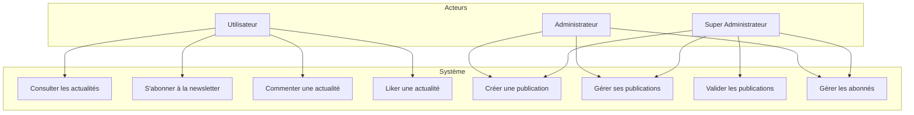
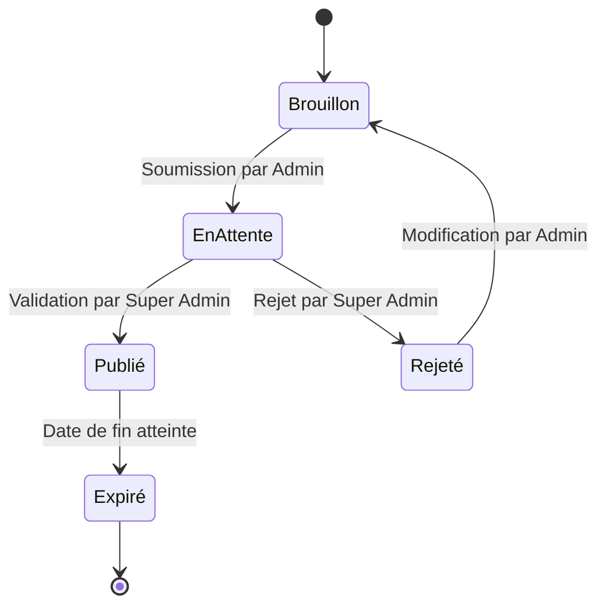
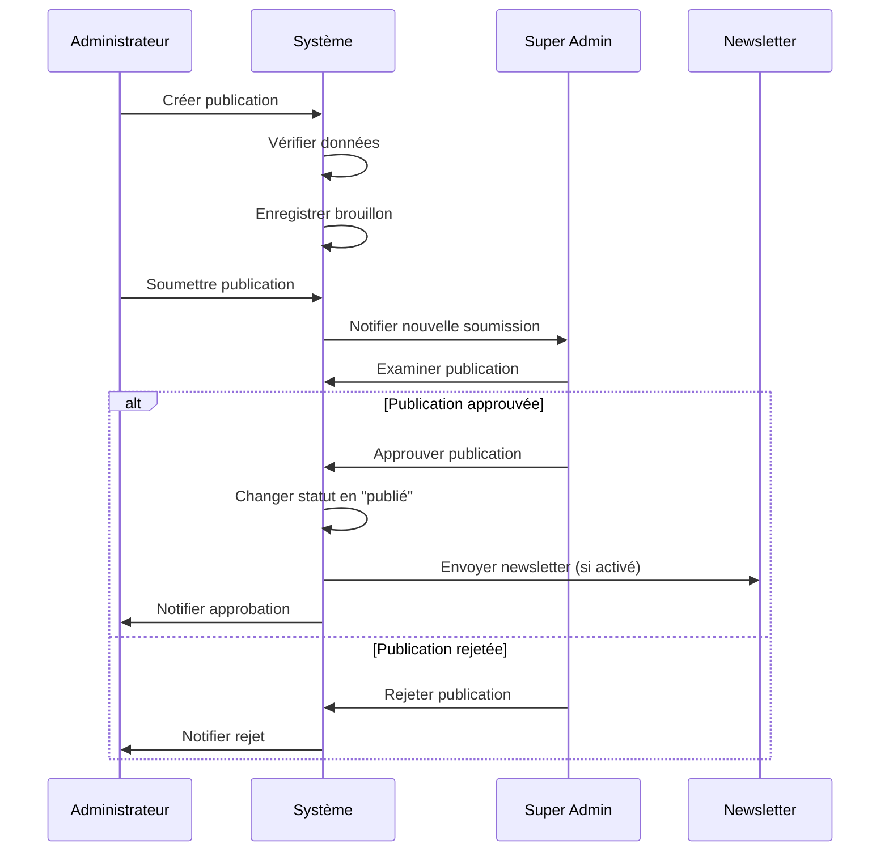

# Documentation Technique - Avolta Belgique

[Previous content remains unchanged until section 4...]

## 4. Modèles de Données et Diagrammes UML

### 4.1 Diagramme de Classes
```mermaid
classDiagram
    class User {
        +String id
        +String email
        +String password
        +Role role
        +validatePublication(Publication)
        +createPublication(Publication)
    }
    
    class Publication {
        +String id
        +String title
        +String content
        +String imageUrl
        +Date validFrom
        +Date validTo
        +Date createdAt
        +int likes
        +String category
        +Status status
        +String authorId
        +publish()
        +approve()
        +reject()
    }
    
    class Comment {
        +String id
        +String content
        +String author
        +Date createdAt
        +addComment(String)
    }
    
    class NewsletterSubscriber {
        +String id
        +String email
        +Date created_at
        +boolean confirmed
        +Date last_sent_at
        +subscribe()
        +unsubscribe()
    }
    
    Publication "1" *-- "*" Comment
    User "1" -- "*" Publication
    Publication "*" -- "*" NewsletterSubscriber
    
    enum Role {
        SUPERADMIN
        ADMIN
    }
    
    enum Status {
        PENDING
        PUBLISHED
    }
    
    Publication -- Status
    User -- Role
```

### 4.2 Diagramme de Cas d'Utilisation


### 4.3 Diagramme d'État (Publication)


### 4.4 Diagramme de Séquence (Publication d'une actualité)


### 4.5 Cas d'Utilisation Détaillés


**Scénario nominal :**
1. Le super administrateur consulte la liste des publications en attente
2. Le système affiche les publications à valider
3. Le super administrateur sélectionne une publication
4. Le système affiche les détails de la publication
5. Le super administrateur examine le contenu
6. Le super administrateur approuve la publication
7. Le système change le statut en "publié"
8. Le système notifie l'administrateur
9. Le système envoie la newsletter si l'option est activée

**Extensions :**
- 6a. Publication rejetée
  1. Le super administrateur indique les raisons du rejet
  2. Le système change le statut en "rejeté"
  3. Le système notifie l'administrateur avec les raisons
- 9a. Erreur d'envoi newsletter
  1. Le système enregistre l'erreur
  2. Le système notifie l'administrateur
  3. La publication reste publiée

### 4.6 Variantes Technologiques

#### Frontend
- Framework : React 18 avec TypeScript
- UI : Tailwind CSS pour le styling
- État : Context API pour la gestion d'état
- Routing : React Router v6
- Internationalisation : i18next
- Icons : Lucide React

#### Backend
- Base de données : Supabase (PostgreSQL)
- Authentication : Supabase Auth
- Storage : Supabase Storage pour les médias
- API : REST avec Supabase Client

#### Déploiement
- Hébergement : Netlify
- CI/CD : GitHub Actions
- Monitoring : Sentry
- Analytics : Google Analytics